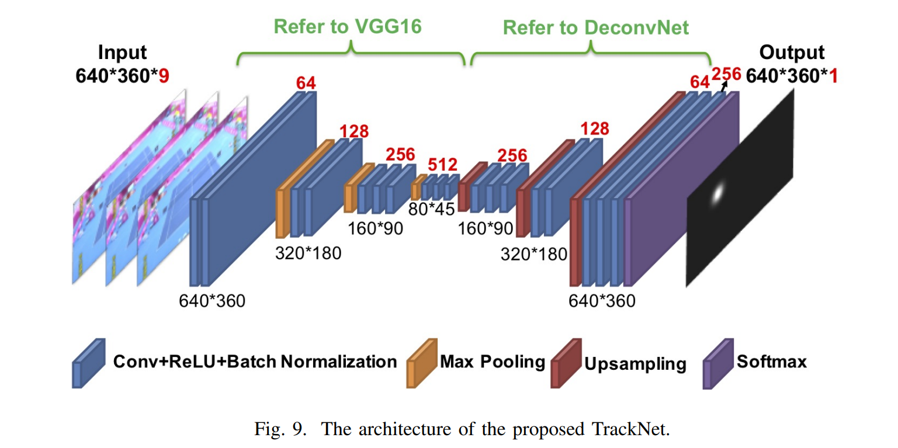

# TrackNet
*Disclaimer: This is not an official implementation.*
TrackNet is a deep learning network to track the tennis ball from broadcast videos in which the ball images are small, blurry, and sometimes with afterimage tracks or even invisible. The proposed heatmap-based deep learning network is trained to not only recognize the ball image from a single frame but also learn flying patterns from consecutive frames. TrackNet takes images with the size of 640 × 360 to generate a detection heatmap from several consecutive frames to position the ball and can achieve high precision even on public domain videos.
This implementation leverages TensorFlow and Keras to achieve precise tracking of tennis balls in dynamic video environments

## Architecture

## Dataset
Dataset is available via the link: https://nycu1-my.sharepoint.com/:u:/g/personal/tik_m365_nycu_edu_tw/ETCr6-M0e1VDhGCdMbvljcsBu31AJTO5xa_1cW8pHa7niA
Dataset consists of video clips of 10 broadcast video. Each video contains several clips from a game. There are 19.835 labeled frames in the dataset.

## Setup
1. Clone the repository `git clone https://github.com/tan1199/TrackNet.git`
2. Install the necessary packages `pip install -r requirements.txt`
3. Follow the below steps to convert videos to training images and heat-maps.
	* Create an `images` subdirectory under the home directory of the repository
    * Extract the game directories from the dataset in `images` folder
    * Create ground truth images and train/test labels via `python generate_groundtruth.py`.
    * Move `labels_train.csv and labels_val.csv` to home directory
4. Run `python train.py` to train the model.

## Demo
Run `python infer.py --input_video_path "/workspace/TrackNet/media/input.mp4" --output_video_path "/workspace/TrackNet/media/output.mp4"` for inference

## Reference
[https://arxiv.org/abs/1907.03698](https://arxiv.org/abs/1907.03698)
TrackNet: A Deep Learning Network for Tracking High-speed and Tiny Objects in Sports Applications
